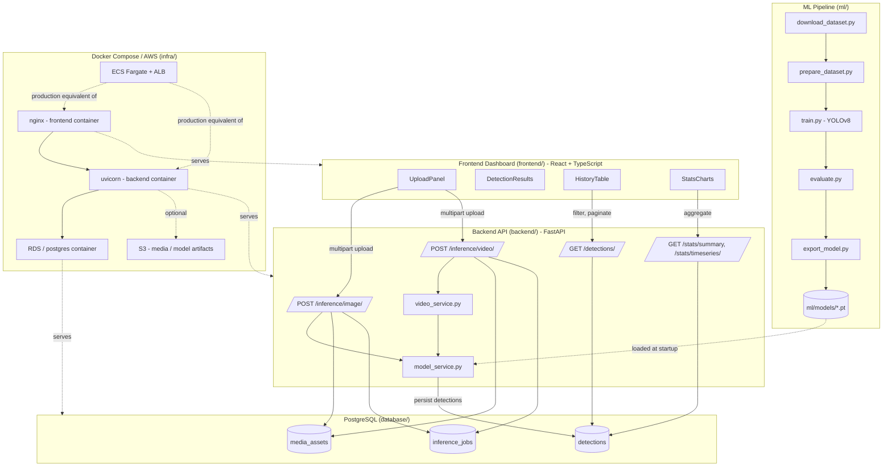
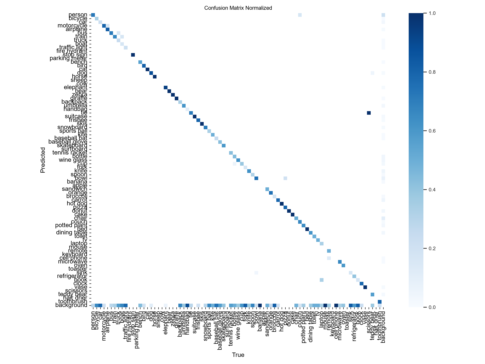
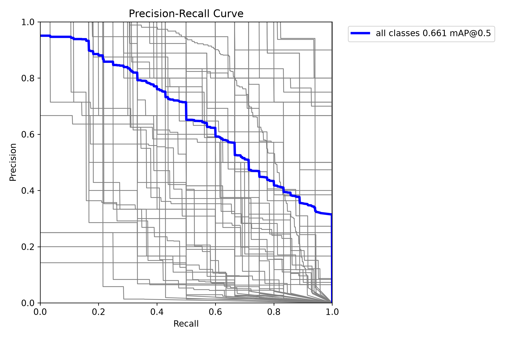
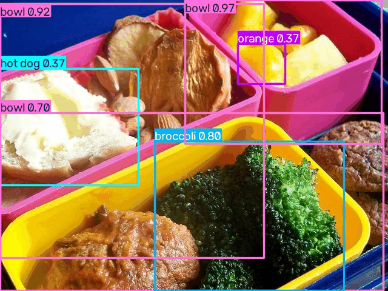

# VisionOps Platform

An end to end computer vision monitoring platform that detects construction site safety violations (missing hardhats, missing masks, missing safety vests) in images and video, serves predictions through a production style API, stores every detection in PostgreSQL, and exposes a real time dashboard. The whole system is containerized and ships with infrastructure as code for AWS and a CI pipeline.

This project exists to demonstrate complete, senior level ML platform engineering: not a single training notebook, but every layer a real product needs to go from a model to something operators can actually use, deployed and observable in production.

## Table of contents

- [Problem and motivation](#problem-and-motivation)
- [Architecture](#architecture)
- [Features](#features)
- [Dataset](#dataset)
- [Repository layout](#repository-layout)
- [Quick start with Docker Compose](#quick-start-with-docker-compose)
- [Running each component without Docker](#running-each-component-without-docker)
- [Usage examples](#usage-examples)
- [Results](#results)
- [Testing and CI/CD](#testing-and-cicd)
- [Cloud deployment](#cloud-deployment)
- [Configuration reference](#configuration-reference)
- [Limitations and future work](#limitations-and-future-work)
- [License](#license)

## Problem and motivation

Construction sites and industrial facilities are required to enforce PPE (personal protective equipment) compliance, but manual monitoring of camera feeds does not scale and is inconsistent. VisionOps Platform automates this: a YOLOv8 model watches uploaded footage for people missing a hardhat, mask or safety vest, every detection is persisted with a timestamp and confidence score, and a dashboard gives safety officers a searchable audit trail and compliance trend charts instead of raw video.

The same architecture generalizes to any frame level anomaly or safety detection problem (PPE, restricted zone intrusion, equipment misuse); PPE compliance was chosen because it has a well known public dataset and a clear, demonstrable notion of a "violation" versus a "compliant" detection.

## Architecture



### Layer responsibilities

| Layer | Responsibility |
|---|---|
| **ML pipeline** ([ml/](ml/)) | Downloads and normalizes the training data, fine-tunes YOLOv8 on PPE classes, evaluates and exports a checkpoint the backend can load. |
| **Backend API** ([backend/](backend/)) | Loads the exported model, validates and processes uploads, runs inference, writes every detection to Postgres, and exposes history and aggregate endpoints. |
| **Database** ([database/](database/)) | System of record. Stores media metadata, individual detections and inference job summaries with a documented, indexed schema. |
| **Frontend** ([frontend/](frontend/)) | Lets a user upload media, see the latest result, browse and filter detection history, and read compliance trend charts. |
| **Infrastructure** ([infra/](infra/), root [docker-compose.yml](docker-compose.yml)) | Packages every component as a container, wires them together locally with Docker Compose, and provisions the equivalent managed AWS services (ECS Fargate, RDS, ALB, S3) through Terraform. |

### Data flow

1. A user uploads an image or video through the dashboard.
2. The backend validates the file, saves it to the media directory, and decodes frames (every Nth frame for video).
3. Each frame is passed to the YOLOv8 model. Any class prefixed with `NO-` (for example `NO-Hardhat`) is flagged as a violation.
4. Every detection, the media asset, and a summary inference job are written to PostgreSQL in the same request.
5. The API returns the detections immediately; the dashboard displays them and refreshes its history table and charts.
6. `/detections` and `/stats` let the dashboard (or any other client) query the accumulated history at any time, independent of the original upload request.

## Features

- Image and video upload with immediate detection results, including bounding boxes, class, confidence and violation status.
- Every detection persisted with a timestamp, model name and model version for full auditability.
- Searchable, paginated detection history with class and violation filters.
- Aggregate statistics: total detections, total violations, compliance rate, per class breakdown, and a daily trend chart.
- Fully typed backend (Pydantic) and frontend (TypeScript) request and response contracts.
- Automated backend test suite (pytest, in-memory SQLite, no external dependencies) and frontend build/lint checks, both run in CI on every push.
- One command local startup with Docker Compose, including health checks and named volumes for the database and uploaded media.
- Terraform configuration to deploy the same containers to AWS (ECS Fargate, RDS, ALB, S3).

## Dataset

The production model targets the public [Construction Site Safety Image Dataset](https://universe.roboflow.com/roboflow-universe-projects/construction-site-safety) from Roboflow Universe: ten classes covering PPE compliance and violations.

```
Hardhat, Mask, NO-Hardhat, NO-Mask, NO-Safety Vest, Person, Safety Cone, Safety Vest, machinery, vehicle
```

`ml/scripts/download_dataset.py` downloads it given a free Roboflow API key. See [ml/README.md](ml/README.md) for the full pipeline and for a no-auth "smoke test" mode used to validate the pipeline in CI without any external account.

## Repository layout

```
VisionOps-Platform/
├── ml/                 Dataset prep, training, evaluation, export (Python, YOLOv8)
├── backend/            FastAPI inference and history API
├── database/           PostgreSQL schema and seed data
├── frontend/           React + TypeScript dashboard
├── infra/terraform/    AWS infrastructure as code (ECS, RDS, ALB, S3)
├── .github/workflows/  CI pipeline (lint, tests, terraform validate)
├── docker-compose.yml  Full local stack
└── .env.example         Environment variables for every service
```

Each component folder has its own README with setup, run and test instructions: [ml/README.md](ml/README.md), [backend/README.md](backend/README.md), [database/README.md](database/README.md), [frontend/README.md](frontend/README.md), [infra/terraform/README.md](infra/terraform/README.md).

## Quick start with Docker Compose

Run one command at a time.

```
cp .env.example .env
```

```
docker compose up --build
```

Once every container reports healthy:

- Dashboard: http://localhost:8080
- API docs: http://localhost:8000/docs
- API health: http://localhost:8000/api/v1/health

The database is seeded automatically on first start (see [database/seed.sql](database/seed.sql)), so the dashboard has sample data immediately.

Stop the stack:

```
docker compose down
```

Stop and remove all data (database and uploaded media volumes):

```
docker compose down -v
```

> The backend container loads whatever checkpoint is at `ml/models/visionops_ppe.pt` (mounted read-only from the host). Train a model first following [ml/README.md](ml/README.md), or the `/inference/*` endpoints will return `503` until a checkpoint exists; every other endpoint works immediately against the seeded data.

## Running each component without Docker

For active development, each component also runs standalone. See the linked README for full detail; the short version:

```
cd ml && python -m venv .venv && ml/.venv/Scripts/activate && pip install -r requirements.txt
```

```
cd backend && python -m venv .venv && backend/.venv/Scripts/activate && pip install -r requirements-dev.txt && python scripts/init_db.py && uvicorn app.main:app --reload
```

```
cd frontend && npm install && npm run dev
```

## Usage examples

Upload an image for inference:

```
curl -X POST http://localhost:8000/api/v1/inference/image \
  -F "file=@sample.jpg"
```

Upload a video clip:

```
curl -X POST http://localhost:8000/api/v1/inference/video \
  -F "file=@clip.mp4"
```

List only safety violations from the last day, paginated:

```
curl "http://localhost:8000/api/v1/detections?is_violation=true&limit=20&offset=0"
```

Get the current compliance summary:

```
curl http://localhost:8000/api/v1/stats/summary
```

Every endpoint is also documented interactively at `/docs` (Swagger UI) once the backend is running.

## Results

The metrics and artifacts below (`ml/reports/`) come from a pipeline smoke test: `yolov8n` trained for 5 epochs on COCO128, a small public, no-auth sample used to prove the full download, train, evaluate, export and predict pipeline runs correctly end to end. It is a pipeline validation, not a measure of PPE detection accuracy. See [ml/README.md](ml/README.md) for how to reproduce the same pipeline against the full ten class PPE dataset to get production accuracy numbers; the code path is identical, only the dataset source changes.

**Overall (smoke test): mAP@0.5 = 0.661, mAP@0.5:0.95 = 0.491, precision = 0.660, recall = 0.592**

| Class | Precision | Recall | mAP@0.5 |
|---|---|---|---|
| person | 0.772 | 0.681 | 0.772 |
| dog | 0.638 | 0.889 | 0.925 |
| bus | 0.676 | 0.714 | 0.721 |
| car | 0.609 | 0.217 | 0.314 |
| bicycle | 0.543 | 0.333 | 0.325 |

Full per class table (71 of 80 classes had validation instances): [ml/reports/metrics.md](ml/reports/metrics.md). Raw numbers: [ml/reports/metrics.json](ml/reports/metrics.json).

**Confusion matrix**



**Precision-recall curve**



**Sample predictions**



## Testing and CI/CD

[.github/workflows/ci.yml](.github/workflows/ci.yml) runs on every push and pull request against `main`:

| Job | Steps |
|---|---|
| `backend` | `ruff check`, then `pytest` with coverage against an in-memory SQLite database and a fake model service, no external dependencies required. |
| `frontend` | `eslint`, then `tsc -b && vite build`. |
| `terraform` | `terraform fmt -check`, `terraform init -backend=false`, `terraform validate`. |

Run the same checks locally:

```
cd backend && ruff check app tests && pytest -v
```

```
cd frontend && npm run lint && npm run build
```

## Cloud deployment

[infra/terraform](infra/terraform) provisions the AWS equivalent of the Docker Compose stack: ECS Fargate services for the backend and frontend behind an Application Load Balancer, RDS for PostgreSQL, and an S3 bucket for media or model artifacts. Full step by step instructions, one command at a time, are in [infra/terraform/README.md](infra/terraform/README.md).

Summary:

1. Build and push the backend and frontend images to a registry (ECR).
2. `terraform init`, fill in `terraform.tfvars` with the image URIs and a database password.
3. `terraform apply`.
4. `terraform destroy` to tear everything down and stop billing.

## Configuration reference

All services are configured through environment variables, documented in [.env.example](.env.example) at the root and in each component's own `.env.example` ([backend](backend/README.md#configuration), [frontend](frontend/.env.example)). Never commit a real `.env` file; only the `.env.example` templates are tracked.

## Limitations and future work

- The checked-in results are a pipeline smoke test on a generic-object sample, not the real PPE dataset; production accuracy numbers require running the pipeline against the full Roboflow dataset with a GPU.
- Video inference samples frames rather than processing every frame, trading completeness for request latency; a production deployment would move long running video jobs to an async queue instead of a synchronous HTTP request.
- Media is stored on a local (or EFS-backed) volume rather than S3 directly; the Terraform S3 bucket is provisioned but not yet wired into the backend's storage service.
- There is no authentication on the API or dashboard; a real deployment needs at minimum an API key or OAuth in front of the upload and history endpoints.
- The Terraform network places RDS and ECS tasks in public subnets to avoid NAT gateway cost in a demo deployment; production should move them to private subnets.

## License

[MIT](LICENSE)
