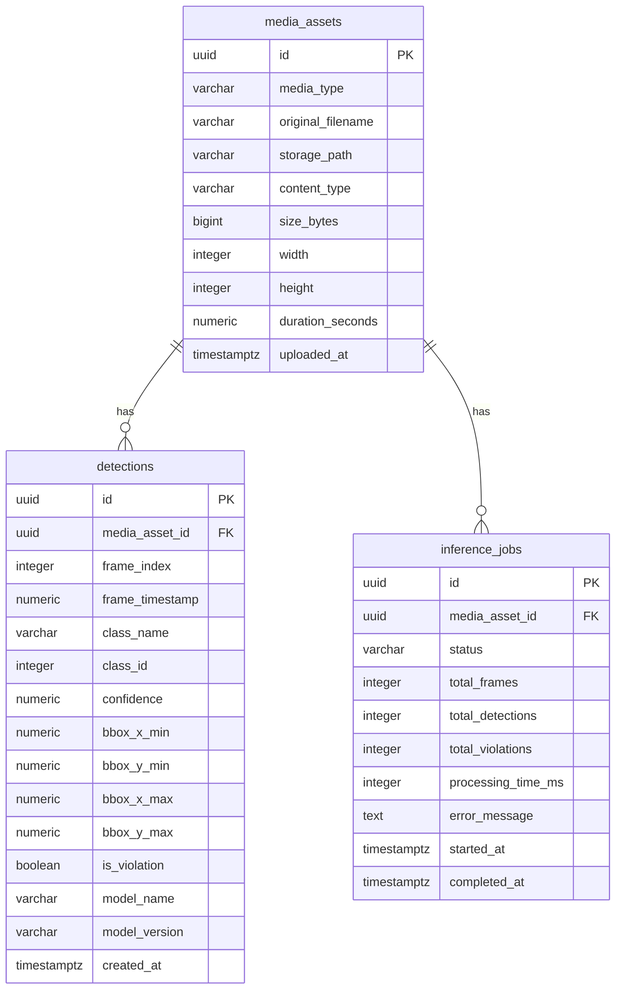

# Database

PostgreSQL is the system of record for every detection produced by the backend API. This folder holds the raw SQL used to create the schema and to seed the database with demonstration data.

## Schema overview



### Tables

- **media_assets** - one row per uploaded image or video. Stores where the raw file lives on disk (or object storage) and basic metadata (dimensions, size, duration).
- **detections** - one row per object detected by the model. For a video, `frame_index` and `frame_timestamp` identify which frame produced the row. `is_violation` flags safety non-compliance classes (any class prefixed with `NO-`, for example `NO-Hardhat`).
- **inference_jobs** - one row per API inference request, used to report processing time and totals without re-aggregating the `detections` table on every request.

A `detection_class_summary` view pre-aggregates detection counts, violation counts and average confidence per class for the `/stats` endpoints.

## Files

| File | Purpose |
|---|---|
| [init.sql](init.sql) | Creates extensions, tables, indexes and the summary view. Runs automatically on first container start because it is mounted into `/docker-entrypoint-initdb.d` in `docker-compose.yml`. |
| [seed.sql](seed.sql) | Inserts a small, realistic set of demonstration rows so the dashboard has data before any real upload happens. |

## Running manually

```
psql "$DATABASE_URL" -f database/init.sql
psql "$DATABASE_URL" -f database/seed.sql
```

The backend also exposes a `scripts/init_db.py` style entrypoint (see [backend/README.md](../backend/README.md)) that applies the same SQL through SQLAlchemy for local development without a running `psql` client.
